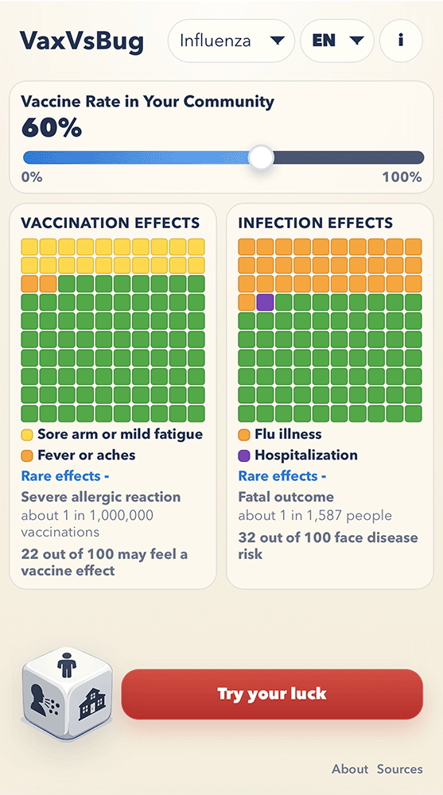

# VaxVsBug

VaxVsBug is a static educational web app that compares:

- vaccination effects
- infection effects
- the effect of community vaccine rate on disease risk

It is designed to be fast, lightweight, and easy to inspect or extend.

Live site:

- https://vaxvsbug.com

## Screenshot



## What It Does

- compares vaccination and infection outcomes side by side
- visualizes risk with two 100-cell grids
- lets the user adjust community vaccine rate
- simulates one vaccination outcome and one infection outcome with `Try your luck`
- supports multiple diseases from a JSON dataset
- supports localization

## Interpretation and Scope

VaxVsBug is an educational comparison tool.

It is designed to illustrate how:

- infectious disease risk changes with community vaccination
- disease outcomes compare alongside vaccine side-effect risk in a simplified scenario

It does not provide real-world risk predictions or medical guidance.

Disease risk in the app reflects population-level transmission dynamics, while vaccine side effects reflect individual-level probabilities. These are different types of risk, and the comparison is intended for exploration rather than decision-making.

## Tech Stack

- plain `HTML`
- plain `CSS`
- plain `JavaScript`
- no framework
- no build step
- no backend

## App Structure

```txt
App/
  index.html
  style.css
  app.js
  data.json
  js/
  locales/
  img/
  docs/
```

## Main Files

- [`index.html`](index.html) - app shell and static panel content
- [`style.css`](style.css) - layout, visual system, animation, responsive behavior
- [`app.js`](app.js) - app bootstrap and module wiring
- [`data.json`](data.json) - disease, vaccine, source, and probability data
- [`js/`](js) - app modules
- [`locales/`](locales) - language files
- [`docs/Environmental-Hostility.md`](docs/Environmental-Hostility.md) - calibration notes for `environmental_hostility`
- [`docs/Data-Integrity-Notes.md`](docs/Data-Integrity-Notes.md) - notes on how grounded the disease and vaccine probabilities are

## Running Locally

Because the app uses `fetch()` for JSON and locale files, run it from a local web server rather than opening the HTML file directly.

Examples:

```bash
cd App
python3 -m http.server 8000
```

Then open:

```txt
http://localhost:8000/
```

## URL Parameters

- `?lang=en`
- `?lang=fi`
- `?disease=measles`

Example:

```txt
https://vaxvsbug.com/?lang=fi&disease=polio
```

## Data Notes

The app uses a comparative scenario model.

In particular:

- `environmental_hostility` is an app-level composite variable that represents overall transmission pressure in the shared scenario
- it combines multiple factors into a single value to keep the model intuitive and comparable across diseases
- it is not a direct official metric
- disease outcomes are simplified into a UI-friendly educational model
- the data, wording, and source links have been manually reviewed

Supporting notes are documented in:

- [`docs/Environmental-Hostility.md`](docs/Environmental-Hostility.md)
- [`docs/Data-Integrity-Notes.md`](docs/Data-Integrity-Notes.md)

## Localization

Current languages:

- English
- Finnish

The app is structured so more languages can be added through the locale files in [`locales/`](locales).

## Contributing

Helpful contribution areas:

- language additions and copy review
- disease-by-disease data audit
- source verification
- UI polish and accessibility improvements

## Support VaxVsBug

If you find VaxVsBug useful, you can support its continued development:

- **GitHub Sponsors** – support the open-source work, updates, and future improvements directly.  
  [Become a GitHub Sponsor](https://github.com/sponsors/janne-s)

- **Ko-fi** – make a one-off tip or small donation to support the project.  
  [Support on Ko-fi](https://ko-fi.com/jannesarkela)

  [](https://ko-fi.com/Z8Z21VZ78L)

Thank you for helping support independent open-source educational work.

See [**Sanara Creations**](https://www.sanaracreations.fi/) for my multidisciplinary work, both solo and in collaboration with others.
